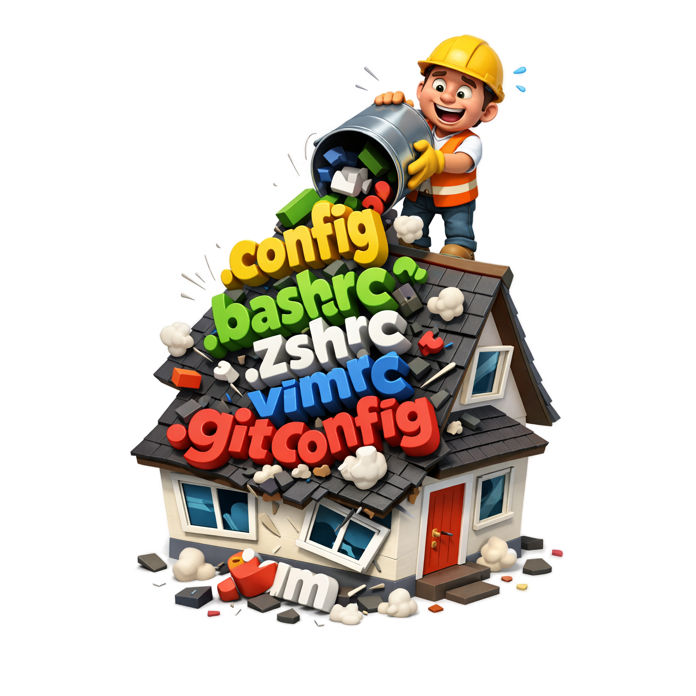

<p align="center">
  
</p>

# dotfiles-manager

`dotfiles-manager` is **the best** config-driven tool for syncing dotfiles between a repository-managed **source** (manifest, source of truth) and one or more `$HOME`-relative **targets**.

<p align="center"><em>If its not working for you - you are doing something wrong.</em></p>

---

## Introduction

This repository contains the CLI implementation plus internal/user docs for behavior, contracts, and engineering standards.

Core workflows:
- `status` — preview drift and candidate operations
- `diff` — preview unified patches for candidate changes
- `deploy` — apply source -> target
- `import` — apply target -> source (managed updates + optional unmanaged/missing rules)
- `version` / `--version` — print CLI version and exit

---

## Installation

### Install with Homebrew (recommended)

```bash
brew install shpoont/tap/dotfiles-manager
```

### Install with Go

```bash
go install github.com/shpoont/dotfiles-manager/cmd/dotfiles-manager@latest
```

### Build locally from source

```bash
git clone <repo-url>
cd dotfiles-manager
go build -o dotfiles-manager ./cmd/dotfiles-manager
```

### Release artifacts

GitHub Releases publish:
- macOS amd64/arm64
- Linux amd64/arm64
- checksums

---

## Main concepts

1. **Source vs target**
   - `source` = manifest, source of truth (relative to config file directory)
   - `target` = live location under `$HOME` (relative path in config)
   - both may include environment variables (`$VAR` / `${VAR}`) that are expanded at runtime
   - expansion happens before normalization/validation
   - missing/empty env vars are errors; expanded paths must still be relative and non-escaping

2. **Sync entries**
   - config has `syncs[]`, each with one `target` + one `source`

3. **Pattern-driven behavior**
   - deploy cleanup: `on.deploy.remove-unmanaged`
   - import unmanaged adds: `on.import.add-unmanaged.include/exclude`
   - import missing deletes: `on.import.remove-missing.include/exclude`
   - defaults are safe (`[]`): unmanaged/missing candidate scans stay off unless explicitly configured

4. **Scoped runs**
   - optional `[path]` narrows commands to matching target subpaths
   - matching uses post-expansion target roots

5. **Preview and safety**
   - `status` is preview
   - `diff` is preview
   - `deploy`/`import` support `--dry-run`

6. **Config resolution order**
   - `--config <path>` (highest priority)
   - `DOTFILES_MANAGER_CONFIG` (if `--config` is not provided)
   - `./.dotfiles-manager.yaml` in the current working directory (fallback)
   - no parent-directory search is performed

7. **Logging destination**
   - logs are always written to a log file
   - default paths:
     - macOS: `~/Library/Logs/dotfiles-manager/dotfiles-manager.log`
     - Linux: `${XDG_STATE_HOME:-~/.local/state}/dotfiles-manager/dotfiles-manager.log`
   - `--log-file <path>` overrides the destination path
   - logs are always human-readable text (no log format option)

8. **Logging level**
   - default log level is `info`
   - set `--log-level <debug|info|warn|error>` for verbosity control

9. **stderr behavior**
   - warnings and errors are emitted as human-readable diagnostics on stderr
   - command output remains on stdout

---

## Quick start

1) Create config file in your project root:

```yaml
# .dotfiles-manager.yaml
syncs:
  - target: .config/nvim
    source: .config/nvim
  - target: ./
    source: ./global
  - target: ./
    source: "./$HOSTNAME/$USER"
    on:
      deploy:
        remove-unmanaged:
          - '**/*.bak'
      import:
        add-unmanaged:
          include:
            - '**'
          exclude:
            - '**/*.tmp'
        remove-missing:
          include:
            - 'lua/**'
```

2) Run commands (using default config discovery in current directory):

```bash
dotfiles-manager --version
dotfiles-manager status
dotfiles-manager diff ~/.config/nvim
dotfiles-manager deploy --dry-run ~/.config/nvim
dotfiles-manager deploy ~/.config/nvim
dotfiles-manager import --dry-run ~/.config/nvim
dotfiles-manager import ~/.config/nvim
```

`--version`/`version` prints `dotfiles-manager version <value>` and exits (`dev` on local non-release builds).

3) Optional explicit override:

```bash
dotfiles-manager --config ./custom-config.yaml status
```

---

## Example workflow

Use path-scoped deploy for only `nvim/lua`:

```bash
dotfiles-manager deploy --dry-run ~/.config/nvim/lua
dotfiles-manager deploy ~/.config/nvim/lua
```

Use JSON for automation:

```bash
dotfiles-manager status --json ~/.config/nvim
dotfiles-manager diff --json --direction deploy ~/.config/nvim
```

---

## Documentation map

- `docs/README.md` — full docs map (audience + scope levels)
- `docs/internal/README.md` — canonical internal specs/contracts/engineering docs
- `docs/user/README.md` — user-facing usage docs
- `docs/internal/contracts/config-schema.json` — JSON Schema for `.dotfiles-manager.yaml`
